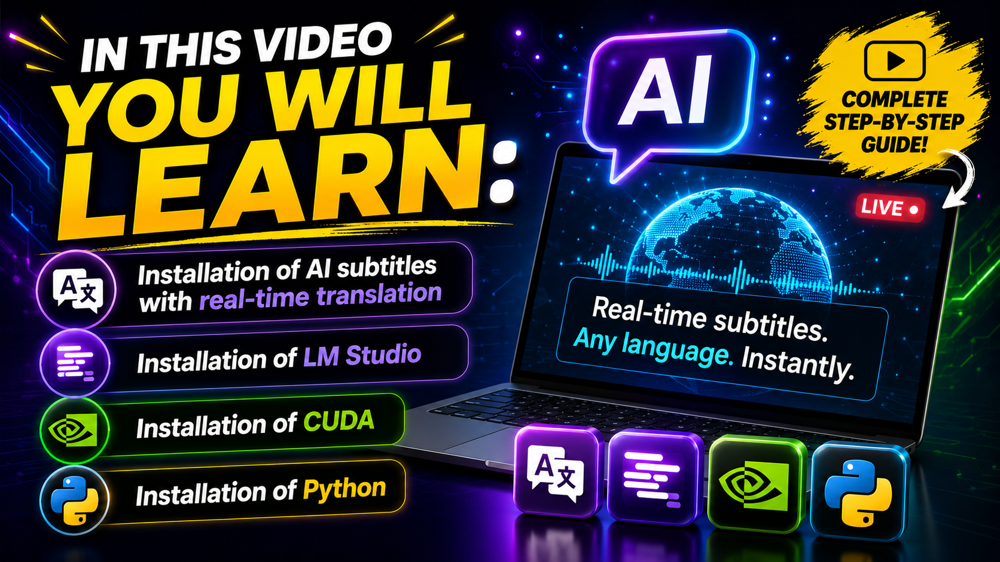

--------------------------------------------------------------------------------
                                  LIVETRANSLATE
                              Real-Time Translation
                         Ollama - LM Studio - Online API
--------------------------------------------------------------------------------

[English](README.md) | [中文](README_zh.md) | [Português](README_pt.md)

LiveTranslate - Real-time audio translation for Windows.

Captures system audio (WASAPI loopback) and optional microphone input, runs ASR
(speech recognition), translates via AI API, and displays results in a
transparent overlay.

Works with any system audio: videos, livestreams, voice chat.
No player modifications needed.


--------------------------------------------------------------------------------
REQUIREMENTS
--------------------------------------------------------------------------------

- OS: Windows 10 or 11
- Python: 3.10 or higher
  
- GPU (recommended): NVIDIA with CUDA 12.4 (RTX 30xx requires CUDA 12.4) 

- Network: optional connection for using translation APIs
- LLM (optional): Ollama, LM Studio or online providers compatible with OpenAI API

--------------------------------------------------------------------------------
REQUIREMENTS DOWNLOADS:
--------------------------------------------------------------------------------
- Python 3.11.9: [https://www.python.org/downloads/release/pymanager-262/](https://www.python.org/downloads/release/python-3119/)
- CUDA Toolkit 12.4 (NVIDIA CUDA). https://developer.nvidia.com/cuda-12-4-0-download-archive
- cuDNN (NVIDIA) – GPU acceleration library for AI (CUDA)
- *If necessary, place these all folders in the directory.* *C:\Program Files\NVIDIA GPU Computing Toolkit\CUDA\v12.4*
https://developer.download.nvidia.com/compute/cudnn/redist/cudnn/windows-x86_64/cudnn-windows-x86_64-8.9.7.29_cuda12-archive.zip

*If you are using local AI, choose LM Studio or Ollama.*
- LM Studio: https://lmstudio.ai/download
- Ollama: https://ollama.com/download/windows

--------------------------------------------------------------------------------
FEATURES
--------------------------------------------------------------------------------

- Real-time pipeline: System audio -> VAD -> ASR -> Translation -> Overlay
- Multiple ASR engines: faster-whisper, SenseVoice, FunASR Nano, Anime-Whisper
- Any OpenAI-compatible API: DeepSeek, Grok, Qwen, GPT, Ollama, vLLM
- Streaming translation display (character by character)
- Per-model settings (streaming, JSON, context history)
- Microphone mixing with system audio
- Low-latency VAD (32ms + adaptive silence detection)
- Transparent overlay (always-on-top, click-through, draggable)
- 14 color themes
- CUDA acceleration for ASR
- Automatic model management (ModelScope / HuggingFace)
- Built-in benchmark

--------------------------------------------------------------------------------
SUPPORTED LLM PROVIDERS
--------------------------------------------------------------------------------

LM Studio:
  http://localhost:1234/v1
  http://127.0.0.1:1234/v1
  "api_key": "lm-studio"

Ollama:
  http://localhost:11434/v1
  http://127.0.0.1:11434/v1
  "api_key": "ollama"

OpenAI (official):
  https://api.openai.com/v1
  (API Key)

OpenRouter:
  https://openrouter.ai/api/v1
  (API Key)

Groq:
  https://api.groq.com/openai/v1
  (API Key)

Together AI:
  https://api.together.xyz/v1
  (API Key)

Fireworks AI:
  https://api.fireworks.ai/inference/v1
  (API Key)

--------------------------------------------------------------------------------
LANGUAGES SUPPORTED BY THE TRANSLATOR (44 languages)
--------------------------------------------------------------------------------

Code | Language
-----|----------------
en   | English
ja   | Japanese
zh   | Chinese
ko   | Korean
pt   | Portuguese
es   | Spanish
fr   | French
de   | German
it   | Italian
nl   | Dutch
ru   | Russian
pl   | Polish
tr   | Turkish
ar   | Arabic
th   | Thai
vi   | Vietnamese
id   | Indonesian
ms   | Malay
hi   | Hindi
uk   | Ukrainian
cs   | Czech
ro   | Romanian
el   | Greek
hu   | Hungarian
sv   | Swedish
da   | Danish
fi   | Finnish
no   | Norwegian
he   | Hebrew

--------------------------------------------------------------------------------
QUICK START
--------------------------------------------------------------------------------

1. Clone the repository:
```bash
git clone https://github.com/MurilloGava/LiveTranslate.git
cd LiveTranslate
```

2. Run install.bat (detects Python, creates virtual environment, installs dependencies)

3. Run start.bat to launch

To update: run update.bat

or

--------------------------------------------------------------------------------
Manual install
--------------------------------------------------------------------------------
```bash
python -m venv .venv
.venv\Scripts\activate

# PyTorch (choose one)
pip install torch torchaudio --index-url https://download.pytorch.org/whl/cu126  # CUDA
pip install torch torchaudio --index-url https://download.pytorch.org/whl/cu128  # CUDA (RTX 50xx)
pip install torch torchaudio --index-url https://download.pytorch.org/whl/cpu    # CPU only

# Dependencies
pip install -r requirements.txt
pip install funasr --no-deps

# Launch
.venv\Scripts\python.exe main.py
```

> FunASR uses `--no-deps` because `editdistance` requires a C++ compiler. `editdistance-s` in `requirements.txt` is a pure-Python drop-in replacement.


--------------------------------------------------------------------------------
FIRST LAUNCH
--------------------------------------------------------------------------------

1. Setup wizard appears
2. Choose download source (ModelScope or HuggingFace)
3. Silero VAD + SenseVoice models download automatically (~1GB)
4. Main UI appears when ready

--------------------------------------------------------------------------------
TRANSLATION API SETUP
--------------------------------------------------------------------------------

## Translation API

Settings → Translation tab:

Local 1 Ollama:
| Parameter | Example |
|-----------|---------|
| API Base | `http://127.0.0.1:11434/v1` |
| API Key | `ollama` |
| Model | `qwen2.5:0.5b` |
| Proxy | `none` / `system` / custom URL |

Local 2 LM Studio:
| Parameter | Example |
|-----------|---------|
| API Base | `http://127.0.0.1:1234/v1` |
| API Key | `lm-studio` |
| Model | `qwen2.5-0.5b-instruct` |
| Proxy | `none` / `system` / custom URL |

Online
| Parameter | Example |
|-----------|---------|
| API Base | `https://api.deepseek.com/v1` |
| API Key | Your key |
| Model | `deepseek-chat` |
| Proxy | `none` / `system` / custom URL |


*Example LM Studio*


--------------------------------------------------------------------------------
RECOMMENDED MODELS FOR LIVE TRANSLATION
--------------------------------------------------------------------------------

1. Qwen2.5-0.5B-Instruct (BEST CHOICE)
   - Fast, low latency
   - Superior translation quality
   - Supports 29+ languages

2. Llama-3.2-1B-Instruct
   - Larger (1B), good quality
   - May be slower


--------------------------------------------------------------------------------

## Screenshot
--------------------------------------------------------------------------------


--------------------------------------------------------------------------------
SUBTITLE WINDOW POSITION CONFIGURATION

Subtitle Window is now fully draggable by the user using mouse drag (improved UI flexibility and positioning control)
--------------------------------------------------------------------------------
Example:

--------------------------------------------------------------------------------


--------------------------------------------------------------------------------
## Video Install


- [YOUTUBE English](https://www.youtube.com/watch?v=iVIpADET9Fg) 
- [YOUTUBE Português](https://www.youtube.com/watch?v=Br_bcuYhRik)
- [BILIBILI 中文](https://www.bilibili.com/video/BV1K2Awz6Euw)


--------------------------------------------------------------------------------
PROJECT ARCHITECTURE
--------------------------------------------------------------------------------

## Architecture

```
Audio (WASAPI 32ms) → VAD (Silero) → ASR → LLM Translation → Overlay
         ↑ optional mic mix-in
```

```
main.py                 Entry point & pipeline
├── audio_capture.py    WASAPI loopback + mic mix-in
├── vad_processor.py    Silero VAD
├── asr_engine.py       faster-whisper backend
├── asr_sensevoice.py   SenseVoice backend
├── asr_funasr_nano.py  FunASR Nano backend
├── asr_anime_whisper.py Anime-Whisper backend (ja anime/galgame)
├── translator.py       OpenAI-compatible client (streaming, JSON schema, context)
├── model_manager.py    Model download & cache
├── subtitle_overlay.py PyQt6 overlay
├── control_panel.py    Settings UI (7 tabs)
├── dialogs.py          Wizard, download & model config dialogs
└── benchmark.py        Translation benchmark
```

## Acknowledgements

- [faster-whisper](https://github.com/SYSTRAN/faster-whisper) — Whisper inference via CTranslate2
- [FunASR](https://github.com/modelscope/FunASR) — SenseVoice / Fun-ASR-Nano
- [Anime-Whisper](https://huggingface.co/litagin/anime-whisper) — Japanese anime/galgame ASR
- [Silero VAD](https://github.com/snakers4/silero-vad) — Voice activity detection

--------------------------------------------------------------------------------
UPDATE
--------------------------------------------------------------------------------
* Improved support for local AI providers (Ollama and LM Studio), enhancing compatibility and stability with OpenAI-compatible endpoints
* Subtitle Window is now fully draggable by the user using mouse drag (improved UI flexibility and positioning control)

  
## License

[MIT License](LICENSE)
