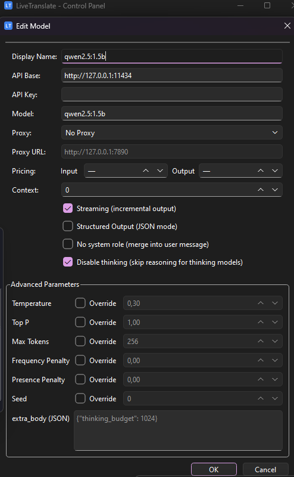
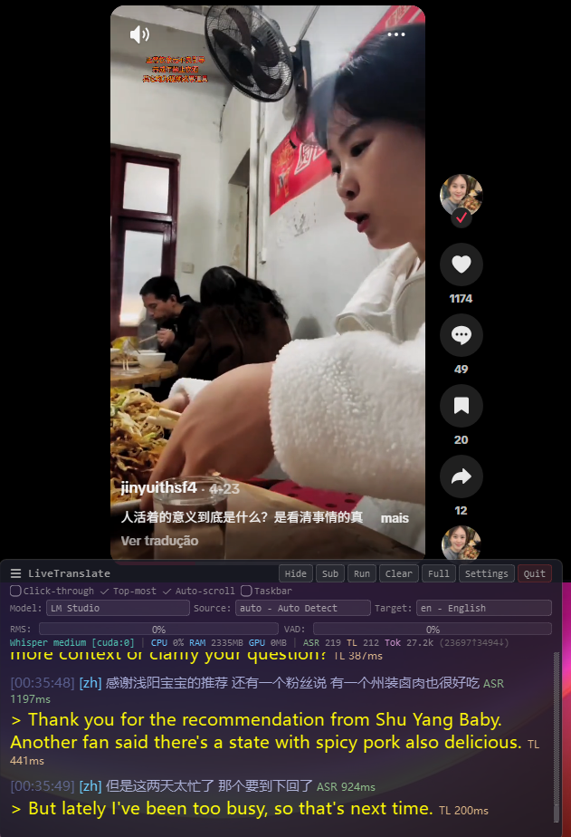
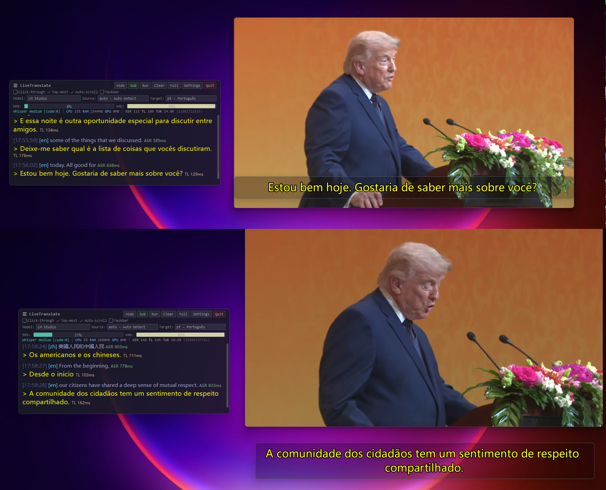
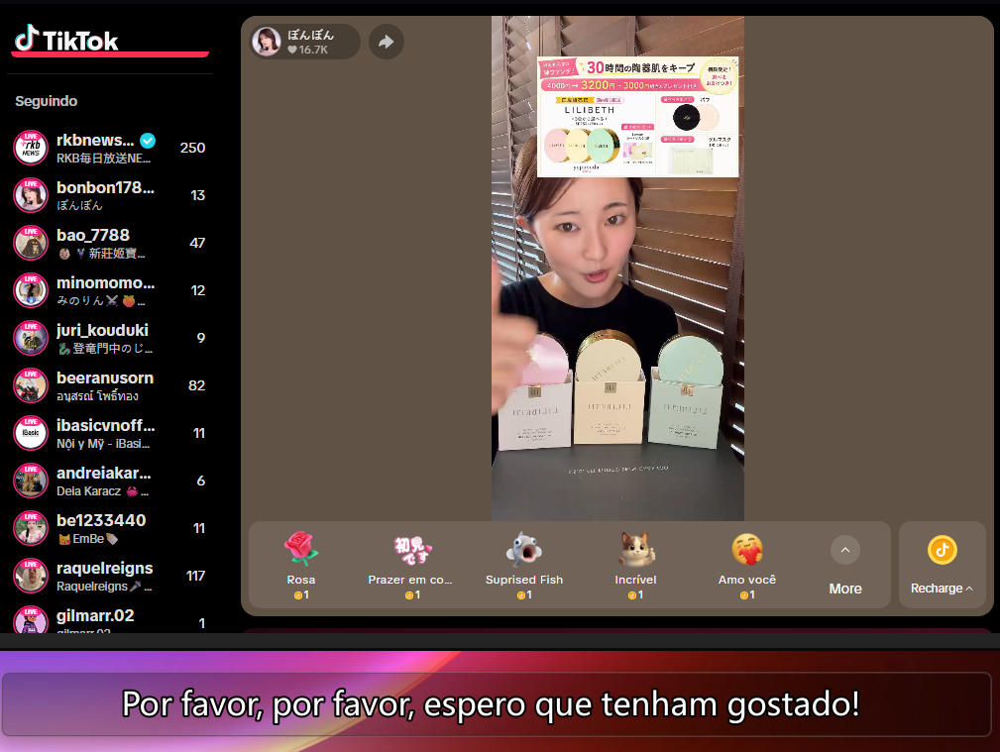

--------------------------------------------------------------------------------
                              LIVETRANSLATE
                          Tradução em Tempo Real
--------------------------------------------------------------------------------
[English](README.md) | [中文](README_zh.md) | [Português](README_pt.md)

LiveTranslate - Tradução de áudio em tempo real para Windows.

Captura áudio do sistema (loopback WASAPI) e microfone opcional, executa ASR
(reconhecimento de fala), traduz via API de IA e exibe os resultados em uma
sobreposição transparente.

Funciona com qualquer áudio do sistema: vídeos, lives, chat de voz.
Não precisa modificar o player.


--------------------------------------------------------------------------------
REQUISITOS
--------------------------------------------------------------------------------

- Sistema: Windows 10 ou 11
- Python: 3.10 ou superior
  
- GPU (recomendado): NVIDIA com CUDA 12.4 (RTX 30xx requer CUDA 12.4) 

- Rede: conexão opcional para uso de APIs de tradução
- LLM (opcional): Ollama, LM Studio ou provedores online compatíveis com API OpenAI

--------------------------------------------------------------------------------
DOWNLOADS REQUISITOS:
--------------------------------------------------------------------------------

- Download: CUDA Toolkit 12.4 (NVIDIA CUDA). https://developer.nvidia.com/cuda-12-4-0-download-archive
- Download: cuDNN (NVIDIA) – GPU acceleration library for AI (CUDA)
- *Se necessário, coloque todas essas pastas no diretório.* *C:\Program Files\NVIDIA GPU Computing Toolkit\CUDA\v12.4*
https://developer.download.nvidia.com/compute/cudnn/redist/cudnn/windows-x86_64/cudnn-windows-x86_64-8.9.7.29_cuda12-archive.zip

*Se você estiver usando IA local, escolha LM Studio ou Ollama.*
- LM Studio: https://lmstudio.ai/download
- Ollama: https://ollama.com/download/windows

--------------------------------------------------------------------------------
FUNCIONALIDADES
--------------------------------------------------------------------------------

- Pipeline em tempo real: Áudio do sistema -> VAD -> ASR -> Tradução -> Sobreposição
- Múltiplos motores ASR: faster-whisper, SenseVoice, FunASR Nano, Anime-Whisper
- Qualquer API compatível com OpenAI: DeepSeek, Grok, Qwen, GPT, Ollama, vLLM
- Exibição de tradução em streaming (caractere por caractere)
- Configurações por modelo (streaming, JSON, histórico de contexto)
- Mixagem de microfone com áudio do sistema
- VAD de baixa latência (32ms + detecção adaptativa de silêncio)
- Sobreposição transparente (sempre no topo, clique-atraves, arrastável)
- 14 temas de cores
- Aceleração CUDA para ASR
- Gerenciamento automático de modelos (ModelScope / HuggingFace)
- Benchmark integrado

--------------------------------------------------------------------------------
PROVEDORES LLM SUPORTADOS
--------------------------------------------------------------------------------

LM Studio:
  http://localhost:1234/v1
  http://127.0.0.1:1234/v1
  "api_key": lm-studio

Ollama:
  http://localhost:11434
  http://127.0.0.1:11434
  "api_key": ollama

OpenAI (official):
  https://api.openai.com/v1
  (API Key)

OpenRouter:
  https://openrouter.ai/api/v1
  (API Key)

Groq:
  https://api.groq.com/openai/v1
  (API Key)

Together AI:
  https://api.together.xyz/v1
  (API Key)

Fireworks AI:
  https://api.fireworks.ai/inference/v1
  (API Key)

--------------------------------------------------------------------------------
IDIOMAS SUPORTADOS PELO TRADUTOR (44 idiomas)
--------------------------------------------------------------------------------

Código | Idioma
-------|----------------
en     | English (Inglês)
ja     | Japanese (Japonês)
zh     | Chinese (Chinês)
ko     | Korean (Coreano)
pt     | Portuguese (Português)
es     | Spanish (Espanhol)
fr     | French (Francês)
de     | German (Alemão)
it     | Italian (Italiano)
nl     | Dutch (Holandês)
ru     | Russian (Russo)
pl     | Polish (Polonês)
tr     | Turkish (Turco)
ar     | Arabic (Árabe)
th     | Thai (Tailandês)
vi     | Vietnamese (Vietnamita)
id     | Indonesian (Indonésio)
ms     | Malay (Malaio)
hi     | Hindi
uk     | Ukrainian (Ucraniano)
cs     | Czech (Tcheco)
ro     | Romanian (Romeno)
el     | Greek (Grego)
hu     | Hungarian (Húngaro)
sv     | Swedish (Sueco)
da     | Danish (Dinamarquês)
fi     | Finnish (Finlandês)
no     | Norwegian (Norueguês)
he     | Hebrew (Hebraico)

--------------------------------------------------------------------------------
INSTALAÇÃO RÁPIDA
--------------------------------------------------------------------------------

1. Clone o repositório:
```bash
git clone https://github.com/MurilloGava/LiveTranslate.git
cd LiveTranslate
```

2. Execute install.bat (detecta Python, cria ambiente virtual, instala dependências)

3. Execute start.bat para iniciar

Para atualizar: execute update.bat

--------------------------------------------------------------------------------
INSTALAÇÃO MANUAL
--------------------------------------------------------------------------------

```bash
python -m venv .venv
.venv\Scripts\activate

# PyTorch (choose one)
pip install torch torchaudio --index-url https://download.pytorch.org/whl/cu126  # CUDA
pip install torch torchaudio --index-url https://download.pytorch.org/whl/cu128  # CUDA (RTX 50xx)
pip install torch torchaudio --index-url https://download.pytorch.org/whl/cpu    # CPU only

# Dependencies
pip install -r requirements.txt
pip install funasr --no-deps

# Launch
.venv\Scripts\python.exe main.py
```

> FunASR uses `--no-deps` because `editdistance` requires a C++ compiler. `editdistance-s` in `requirements.txt` is a pure-Python drop-in replacement.


--------------------------------------------------------------------------------
PRIMEIRA INICIALIZAÇÃO
--------------------------------------------------------------------------------

1. O assistente de configuração aparece
2. Escolha a fonte de download (ModelScope ou HuggingFace)
3. Os modelos Silero VAD + SenseVoice baixam automaticamente (~1GB)
4. A interface principal aparece quando estiver pronto

--------------------------------------------------------------------------------
CONFIGURAÇÃO DA API DE TRADUÇÃO
--------------------------------------------------------------------------------

## Translation API

Settings → Translation tab:

Local 1 Ollama:
| Parameter | Example |
|-----------|---------|
| API Base | `http://127.0.0.1:11434` |
| API Key | `ollama` |
| Model | `qwen2.5:0.5b` |
| Proxy | `none` / `system` / custom URL |

Local 2 LM Studio:
| Parameter | Example |
|-----------|---------|
| API Base | `http://127.0.0.1:1234/v1` |
| API Key | `lm-studio` |
| Model | `qwen2.5:0.5b` |
| Proxy | `none` / `system` / custom URL |

Online
| Parameter | Example |
|-----------|---------|
| API Base | `https://api.deepseek.com/v1` |
| API Key | Your key |
| Model | `deepseek-chat` |
| Proxy | `none` / `system` / custom URL |




--------------------------------------------------------------------------------
MODELOS RECOMENDADOS PARA TRADUÇÃO DE LIVE
--------------------------------------------------------------------------------

1. Qwen2.5-0.5B-Instruct (MELHOR ESCOLHA)
   - Rápido, baixa latência
   - Qualidade de tradução superior
   - Suporta 29+ idiomas

2. Llama-3.2-1B-Instruct
   - Maior (1B), qualidade boa
   - Pode ser mais lento

--------------------------------------------------------------------------------

## Screenshot
--------------------------------------------------------------------------------



--------------------------------------------------------------------------------
CONFIGURAÇÃO DA POSIÇÃO DA JANELA DE LEGENDAS
--------------------------------------------------------------------------------

A Janela de Legendas agora pode ser totalmente arrastada pelo usuário utilizando o mouse (maior flexibilidade da interface e controle de posicionamento).

Exemplo:

--------------------------------------------------------------------------------

--------------------------------------------------------------------------------
--------------------------------------------------------------------------------
## Video
--------------------------------------------------------------------------------
ARQUITETURA DO PROJETO
--------------------------------------------------------------------------------


```
Audio (WASAPI 32ms) → VAD (Silero) → ASR → LLM Translation → Overlay
         ↑ optional mic mix-in
```

```
main.py                 Entry point & pipeline
├── audio_capture.py    WASAPI loopback + mic mix-in
├── vad_processor.py    Silero VAD
├── asr_engine.py       faster-whisper backend
├── asr_sensevoice.py   SenseVoice backend
├── asr_funasr_nano.py  FunASR Nano backend
├── asr_anime_whisper.py Anime-Whisper backend (ja anime/galgame)
├── translator.py       OpenAI-compatible client (streaming, JSON schema, context)
├── model_manager.py    Model download & cache
├── subtitle_overlay.py PyQt6 overlay
├── control_panel.py    Settings UI (7 tabs)
├── dialogs.py          Wizard, download & model config dialogs
└── benchmark.py        Translation benchmark
```
--------------------------------------------------------------------------------
AGRADECIMENTOS
--------------------------------------------------------------------------------

- [faster-whisper](https://github.com/SYSTRAN/faster-whisper) — Whisper inference via CTranslate2
- [FunASR](https://github.com/modelscope/FunASR) — SenseVoice / Fun-ASR-Nano
- [Anime-Whisper](https://huggingface.co/litagin/anime-whisper) — Japanese anime/galgame ASR
- [Silero VAD](https://github.com/snakers4/silero-vad) — Voice activity detection

--------------------------------------------------------------------------------
ATUALIZAÇÃO 
--------------------------------------------------------------------------------
- MODO IA LOCAL
- USUARIO TEM TOTAL CONTROLE DA BARRA DE LEGENDAS NO ARQUIVO user_settings.json

--------------------------------------------------------------------------------
LICENÇA
--------------------------------------------------------------------------------

MIT License

--------------------------------------------------------------------------------
